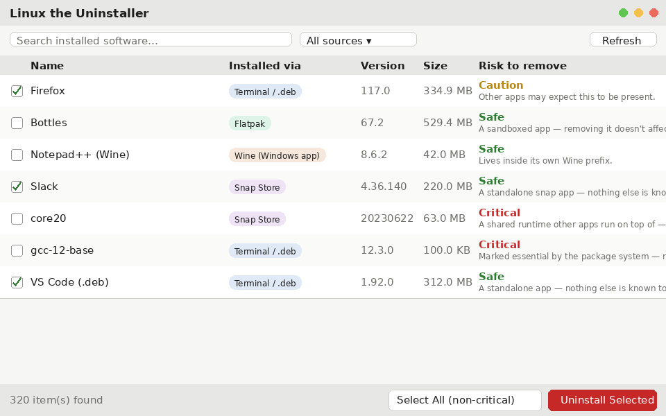

# Linux the Uninstaller

Windows has Revo, IObit, Geek Uninstaller — a whole category of tools that
find installed software no matter how it got there, and scrub the leftovers
behind it. Ubuntu/Debian-based Linux doesn't: the built-in app store only
manages what it installed itself. Anything you `apt install`ed, grabbed as a
`.deb` from a browser, added via Snap or Flatpak outside the store UI, or
run through Wine is invisible to it.

This is one list for all of it — tagged by how it got onto your system,
tagged Safe/Caution/Critical to remove in plain language, with bulk
uninstall and leftover-file cleanup.


*(Hand-drawn mockup of the layout, not a live screenshot — see
[Screenshots](#screenshots) below.)*

## What it detects

| Tag | What it means |
|---|---|
| **Terminal / .deb** | Installed with `apt install` or a downloaded `.deb` (`dpkg -i`). |
| **Snap Store** | Installed as a Snap. |
| **Flatpak** | Installed as a Flatpak. |
| **Wine (Windows app)** | A Windows program installed into a Wine prefix. |

Each item is also rated:

- 🟢 **Safe** — a standalone app; removing it only removes that app.
- 🟡 **Caution** — other apps or your desktop may depend on this; read the
  reason shown before removing.
- 🔴 **Critical** — a core OS/desktop component (tagged **System**); never
  pre-selected by "Select All".

Full requirements: [documents/SRS.md](documents/SRS.md). Design decisions
and why: [documents/ai-knowledgebase.md](documents/ai-knowledgebase.md).

**On Windows?** Apps & Features has the same blind spots — it can't see
Microsoft Store apps in the same list, and it can't see Chocolatey or Scoop
at all. The Windows build lives in [windows/](windows/) and ships as an
`.exe` and an `.msi`.

**On Android?** Settings lists your apps but never says where any of them
came from, removes them one at a time, and leaves behind whatever an app
wrote to your storage. The Android build lives in [android/](android/) and
ships as an `.apk`.

## Installation

**Requirements:** Ubuntu or another Debian-based Linux distribution with a
GTK3 desktop.

### Option A — install the `.deb` (recommended)

Download `linux-the-uninstaller_<version>_all.deb` from the
[Releases page](https://github.com/Redwan-Shawkat/The-Uninstaller/releases),
then:

```bash
sudo apt install ./linux-the-uninstaller_0.1.0_all.deb
```

`apt` pulls in `python3-gi`/`gir1.2-gtk-3.0` itself if they're missing. This
installs system-wide (`/usr/bin`, `/usr/lib`), adds **The Uninstaller** to
your application menu, and — fittingly — uninstalls cleanly:

```bash
sudo apt remove linux-the-uninstaller
```

### Option B — per-user install, no root

Installs into your home directory only. Needs `git` if you clone.

1. **Get the code** — either clone it:
   ```bash
   git clone https://github.com/Redwan-Shawkat/The-Uninstaller.git
   cd The-Uninstaller
   ```
   or download `linux-the-uninstaller-<version>.tar.gz` from the
   [Releases page](https://github.com/Redwan-Shawkat/The-Uninstaller/releases)
   and unpack it:
   ```bash
   tar -xzf linux-the-uninstaller-*.tar.gz
   cd linux-the-uninstaller-*
   ```
2. **Run the installer**
   ```bash
   ./install.sh
   ```
   This installs `python3-gi`/`gir1.2-gtk-3.0` via `apt` only if they're
   missing (a stock Ubuntu desktop already has them — no pip, no venv, see
   [ai-knowledgebase.md](documents/ai-knowledgebase.md#stack-choice) for
   why), copies the app to `~/.local/lib/linux-the-uninstaller`, and adds:
   - a `linux-the-uninstaller` command in `~/.local/bin`
   - an entry in your application menu (**The Uninstaller**)
3. **Open a new terminal** (only needed the first time, so `~/.local/bin`
   is on `PATH`) and run:
   ```bash
   linux-the-uninstaller
   ```
   — or launch it from your application menu instead.

Re-run `./install.sh` any time after a `git pull` (or after unpacking a
newer release tarball) to update. To remove
everything it placed: `./uninstall.sh`.

Pick one of A or B, not both: the `~/.local/bin` launcher from Option B
comes earlier on `PATH` than the packaged `/usr/bin` one, so a stale per-user
copy would quietly win over the `.deb`.

**Don't want to install anything?** Run it straight from the checkout:
```bash
PYTHONPATH=src python3 -m uninstaller
```

### First run

The app only scans (read-only) until you check items and click **Uninstall
Selected**, which always shows a confirmation first. Removing an apt or
Snap package prompts for your password via the desktop's normal
authorization dialog (`pkexec`) — this app never asks for a password
itself.

A spinner and "Scanning for installed software…" show while it's finding
apps; uninstalling shows a progress bar (green on success, red on failure)
naming the app currently being removed. The 🌙/☀ button in the toolbar
switches light/dark mode.

## Build

This is a Python app — "build" means packaging it, not compiling it. A
release artifact is a source tarball of the tagged tree, produced with git's
own archiver (no packaging toolchain involved):

```bash
mkdir -p dist
git archive --format=tar.gz --prefix=linux-the-uninstaller-0.1.0/ \
  -o dist/linux-the-uninstaller-0.1.0.tar.gz v0.1.0
```

Unpack that and run `install.sh` (above) — that's the supported way to get
it onto a machine.

To build the `.deb` release package:

```bash
./build-deb.sh          # -> dist/linux-the-uninstaller_<version>_all.deb
```

It reads the version from `pyproject.toml`, stages a tree under `dist/deb/`
and hands it to `dpkg-deb` — no debhelper or packaging toolchain to install,
and no maintainer scripts (dpkg's own triggers refresh the desktop and icon
caches). A Flatpak package is still tracked as future work in
[documents/features.md](documents/features.md).

## Test

```bash
python3 tests/test_core.py     # or: pytest tests/
```

Covers every parser (dpkg/snap/flatpak/Wine registry) and the risk
classifier with plain asserts — no live system state required.

## Screenshots

The image above is a mockup, not a live screenshot: this repo was put
together in a sandboxed environment where GNOME's screenshot D-Bus API
(`org.gnome.Shell.Screenshot`) refuses non-interactive callers, and the
`xdg-desktop-portal` equivalent needs a human to click through it. Run the
app on your own desktop and drop a real screenshot in `screenshots/` —
happy to update this README to reference it.

## Safety notes

- Uninstalling always shows a confirmation listing exactly what's selected
  and its risk level; Critical/System items require an extra explicit
  checkbox before the Uninstall button unlocks.
- "Select All" never selects Critical/System items — pick those one at a
  time if you really mean it.
- Leftover files are shown and opt-in before deletion, never removed
  silently.

## License

[MIT](LICENSE) — © 2026 Redwan Shawkat.
